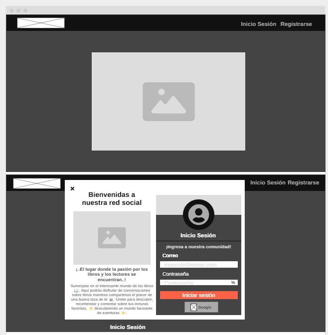
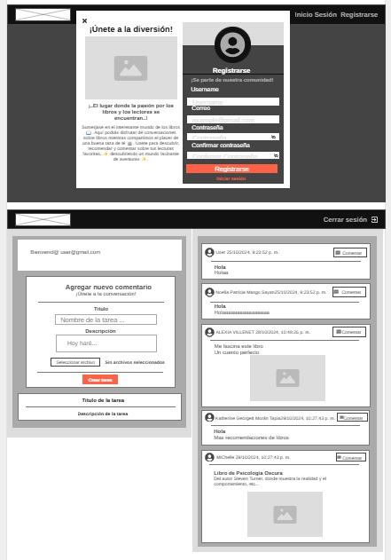
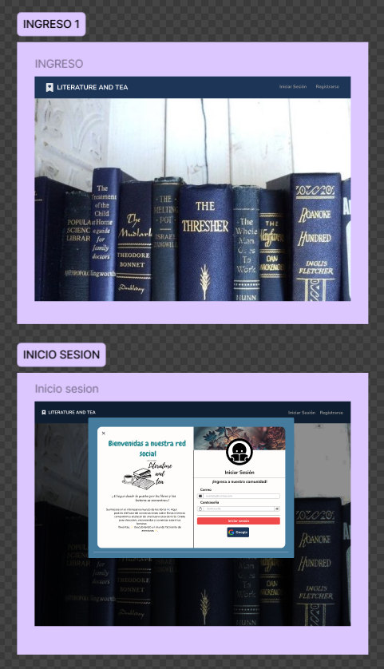
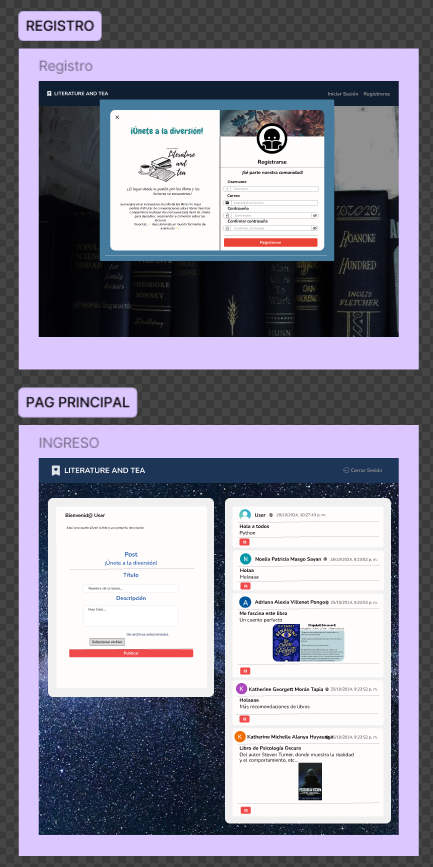

<h1>¡Bienvenido(a) a Literature and Tea 📖☕!  🚀</h1>

**By: Las Suertudas**

---

## Definición del Producto 💡✨

**Literature and Tea 📖☕** es una red social creada para los amantes de los libros, un espacio donde los usuarios pueden interactuar compartiendo recomendaciones, publicando reseñas y comentando sobre sus lecturas favoritas, todo mientras disfrutan de una buena taza de té. La plataforma permite crear, leer, editar y eliminar publicaciones, así como subir imágenes y comentar las publicaciones de otros usuarios.

La red social se enfoca en ofrecer un espacio amigable para los lectores donde puedan descubrir nuevos libros, intercambiar opiniones y fomentar una comunidad literaria. El producto resuelve la necesidad de los usuarios de tener un entorno donde puedan compartir sus intereses literarios de manera dinámica y colaborativa.

## Historias de Usuario ✓👤

1. **Inicio de Sesión y Registro**
    - Como usuario, quiero poder iniciar sesión con mi correo electrónico o cuenta de Google para acceder a mi perfil y publicaciones.
    - Como nuevo usuario, quiero registrarme fácilmente para crear un perfil y comenzar a interactuar con otros lectores.

2. **Publicaciones**
    - Como usuario, quiero crear una publicación con un título, descripción y subir una imagen opcional para compartir mis recomendaciones de libros.
    - Como usuario, quiero poder editar o eliminar mis publicaciones para mantener mi perfil actualizado.

3. **Interacciones Sociales**
    - Como usuario, quiero comentar en las publicaciones de otros para compartir mis opiniones y recomendaciones.
    - Como usuario, quiero que mis publicaciones reciban comentarios para fomentar discusiones y conocer otros puntos de vista sobre los libros.

4. **Perfil de Usuario**
    - Como usuario, quiero poder ver y modificar mi perfil para personalizar mi experiencia en la red social.

## Proceso de Diseño ✓🎨

### 1. Prototipado de Baja Fidelidad ✨
El proceso comenzó con el diseño de un wireframe para estructurar la vista básica de la aplicación. Utilizamos [Wireframe.cc](https://wireframe.cc/6OImuO) para delinear el flujo de la aplicación y las funciones principales que incluiríamos, como el inicio de sesión, el registro, y la vista de publicaciones.

### 2. Codificación
Después de tener el diseño en baja fidelidad, pasamos a la fase de codificación. Durante este proceso, se integraron funciones adicionales para mejorar la experiencia del usuario, como la funcionalidad CRUD para las publicaciones y los comentarios.

### 3. Prototipo en Figma
Finalmente, diseñamos el prototipo de alta fidelidad en [Figma](https://www.figma.com/design/dEXrBh4nxmhTvnnFvBvkNm/Proyecto-Unidad-IV-Las-Suertudas?node-id=64-2&t=Xvh4KSwuowSNY4au-1), donde aplicamos la paleta de colores, fuentes y estilo visual de la plataforma, dando forma al producto final.

## Diseño de la Interfaz de Usuario ✓👤

El flujo de la aplicación sigue los siguientes pasos:

1. El usuario puede acceder a la página principal, donde verá dos opciones en el **Nav**: "Iniciar Sesión" o "Registrarse".
2. Si ya tiene una cuenta, puede iniciar sesión mediante su correo o Google. Si no tiene cuenta, deberá registrarse.
3. Una vez iniciado sesión, se mostrará un **toast** confirmando el acceso y se redirigirá a la página de publicaciones.
4. En la página principal, los usuarios pueden:
    - Crear una publicación (título, descripción, y subir una imagen opcional).
    - Ver y comentar en publicaciones de otros usuarios.
    - Editar o eliminar sus propias publicaciones.
5. Finalmente, el usuario puede cerrar sesión, volviendo a la página original.

## Funcionalidades Clave ✓💡

- **Autenticación:** Inicio de sesión/registro con correo y Google.
- **Publicaciones:** Crear, leer, editar, eliminar publicaciones (CRUD).
- **Comentarios:** Los usuarios pueden interactuar con publicaciones mediante comentarios.
- **Subida de imágenes:** Opción de adjuntar imágenes a las publicaciones.
- **Gestión de perfil:** Cada usuario puede modificar su perfil y datos de acceso.

---
## Capturas del Proyecto ✓📷
**PROTOTIPADO DE BAJA FIDELIDAD ✨ :** 

**PROTOTIPADO DE ALTA FIDELIDAD ✨ :**

---
### ¿Qué tecnologías se estan aplicando?

---
**Literature and Tea 📖☕** ofrece un espacio interactivo para los amantes de la lectura, donde cada usuario puede descubrir nuevas obras y compartir su pasión por los libros con otros.

---
### Conformado por:
- [Noelia Patricia Masgo Sayan](https://github.com/NoeMasgoSayan)
- [Adriana Alexia Villenet Pongo](https://github.com/AAdriana07)
- [Katherine Georget Moran Tapia ](https://github.com/katheriw)
- [Katherine Michelle Alanya Huayunga](https://github.com/bymichelleah)

### ¡Muchas gracias por ver🤍!